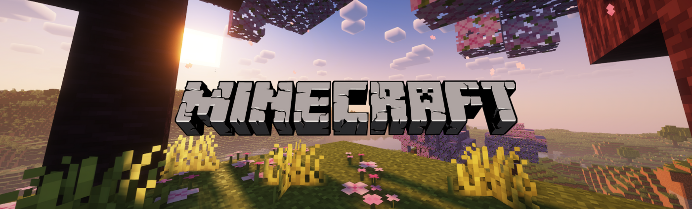

# 🛠️ Minecraft Server

¡Bienvenido a mi proyecto de servidor de Minecraft! Este repositorio contiene todo lo necesario para poner en marcha tu propio servidor de Minecraft utilizando Docker. La configuración está optimizada para la versión de Minecraft Java 1.21 y viene con algunos mods interesantes para mejorar el rendimiento del servidor.

## 📝 Descripción

Este proyecto tiene como objetivo facilitar la creación y administración de un servidor de Minecraft mediante Docker. Incluye un `docker-compose.yml` que levanta el servidor con los mods preconfigurados, así como scripts adicionales para instalar y gestionar el servidor.

## 📦 Contenido del Repositorio

- **docker-compose.yml**: Archivo de configuración para Docker Compose.
- **scripts/**: Carpeta que contiene scripts de instalación y configuración.
  - **setup.sh**: Script para instalar todo lo necesario y poner en marcha el servidor en sistemas Unix.
- **mods/**: Carpeta con los mods incluidos para mejorar el rendimiento del servidor:
  - betterfpsdist-1.21-4.5
  - Clumps-neoforge-1.21-18.0.0.1
  - cupboard-1.21-2.7
  - embeddium-1.0.4+mc1.21
  - ferritecore-7.0.0-neoforge
  - ImmediatelyFast-NeoForge-1.2.18+1.21
  - modernfix-neoforge-5.18.5+mc1.21
  - spark-1.10.73-neoforge

---

## 🚀 Instalación

### Prerrequisitos

- Docker y Docker Compose instalados en tu sistema.
- Acceso a internet para descargar las imágenes y mods necesarios.

### Pasos de Instalación

1. **Clonar el repositorio:**

```sh
git clone https://github.com/JSisques/minecraft-server.git
cd minecraft-server
```

2. **Ejecutar el script de instalación:**

```sh
chmod +x scripts/setup.sh
./scripts/setup.sh
```

3. **Levantar el servidor con Docker Compose:**

```sh
docker-compose up -d
```

---

## ⚙️ Configuración

A continuación se presenta una tabla con las variables de entorno disponibles en `docker-compose.yml` que puedes ajustar según tus necesidades:

| Variable                       | Valor por defecto                  | Descripción                                  |
| ------------------------------ | ---------------------------------- | -------------------------------------------- |
| `VERSION`                      | "1.21.0"                           | Versión de Minecraft.                        |
| `EULA`                         | "TRUE"                             | Aceptar EULA de Minecraft.                   |
| `TYPE`                         | "NEOFORGE"                         | Tipo de servidor.                            |
| `NEOFORGE_VERSION`             | "beta"                             | Versión de NeoForge.                         |
| `MEMORY`                       | "3G"                               | Memoria máxima asignada al servidor.         |
| `INIT_MEMORY`                  | "3G"                               | Memoria inicial asignada al servidor.        |
| `MAX_MEMORY`                   | "3G"                               | Memoria máxima asignada al servidor.         |
| `MOTD`                         | "Recordad portaros bien muchachos" | Mensaje del día para el servidor.            |
| `MAX_PLAYERS`                  | 5                                  | Número máximo de jugadores.                  |
| `DIFFICULTY`                   | "normal"                           | Dificultad del juego.                        |
| `OPS`                          | "bunno6661"                        | Lista de operadores del servidor.            |
| `EXISTING_OPS_FILE`            | "SYNCHRONIZE"                      | Sincronizar archivo de operadores existente. |
| `ICON`                         | URL de icono                       | URL del icono del servidor.                  |
| `ALLOW_NETHER`                 | "true"                             | Permitir el Nether.                          |
| `ANNOUNCE_PLAYER_ACHIEVEMENTS` | "true"                             | Anunciar logros de los jugadores.            |
| `GENERATE_STRUCTURES`          | "true"                             | Generar estructuras en el mundo.             |
| `HARDCORE`                     | "false"                            | Activar modo hardcore.                       |
| `SNOOPER_ENABLED`              | "false"                            | Habilitar snooper.                           |
| `SPAWN_ANIMALS`                | "true"                             | Generar animales en el mundo.                |
| `SPAWN_MONSTERS`               | "true"                             | Generar monstruos en el mundo.               |
| `SPAWN_NPCS`                   | "true"                             | Generar NPCs en el mundo.                    |
| `VIEW_DISTANCE`                | 6                                  | Distancia de visión del servidor.            |
| `MODE`                         | "survival"                         | Modo de juego del servidor.                  |
| `SERVER_NAME`                  | "Niños con cancer"                 | Nombre del servidor.                         |
| `ALLOW_FLIGHT`                 | "TRUE"                             | Permitir vuelo en el servidor.               |
| `CF_API_KEY`                   | ""                                 | Clave API de CurseForge.                     |

Para más detalles, consulta la documentación oficial de [docker-minecraft-server](https://docker-minecraft-server.readthedocs.io/en/latest/configuration/server-properties/).

---

## ➕ Añadir Mods

Para añadir cualquier mod, descarga su archivo .jar para NeoForge y colócalo en la carpeta mods. Es importante asegurarse de que el mod esté seleccionado para NeoForge, de lo contrario, no funcionará correctamente.

---

## 📜 Licencia

Este proyecto está bajo la Licencia MIT. Consulta el archivo LICENSE para más detalles.

---

## 👨‍💻 Autor

- Nombre: Javier Plaza Sisqués
- GitHub: [JSisques](https://github.com/JSisques)

---

## 🗃️ Referencias

- **Imagen en Docker Hub:** [itzg/minecraft-server](https://hub.docker.com/r/itzg/minecraft-server)
- **Documentación oficial:** [docker-minecraft-server](https://docker-minecraft-server.readthedocs.io/en/latest/)
- **Repositorio original:** Este repositorio se basa en el proyecto [itzg/docker-minecraft-server](https://github.com/itzg/docker-minecraft-server).

---

## 🎮 Disfruta del juego

¡Eso es todo! Ahora ya tienes tu propio servidor de Minecraft en marcha. Conéctate y disfruta de la experiencia junto a tus amigos.
